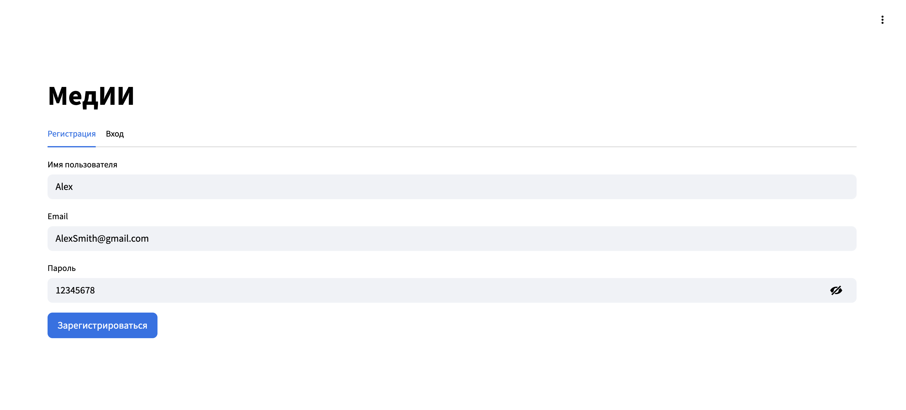
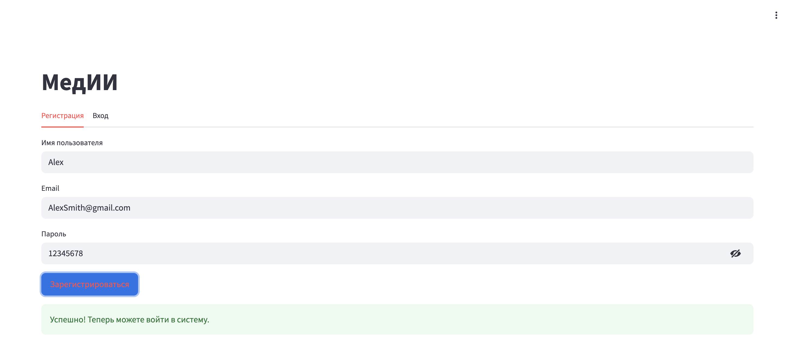
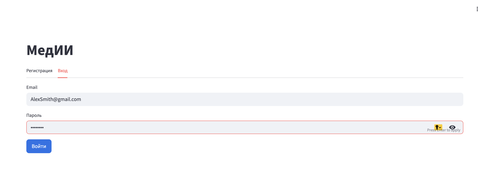
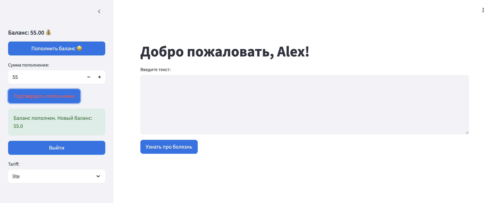
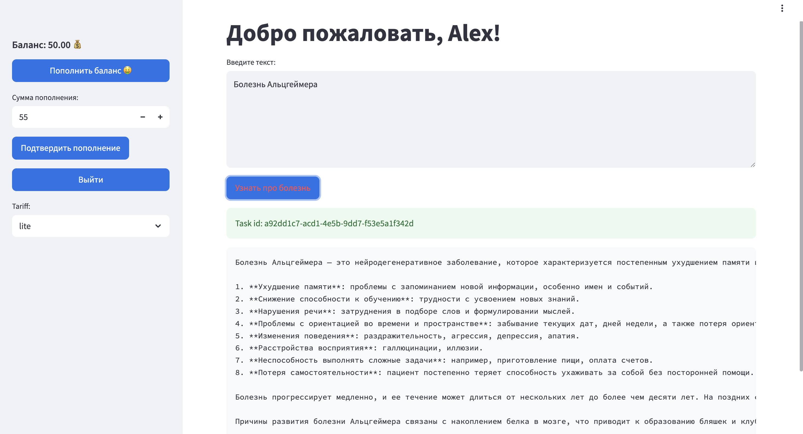
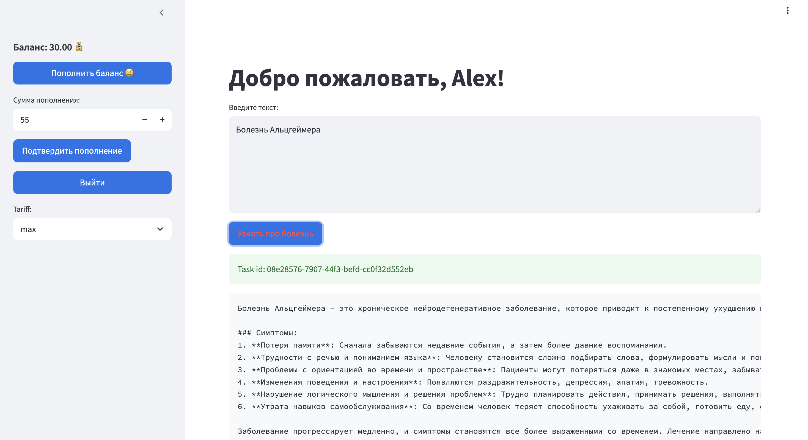
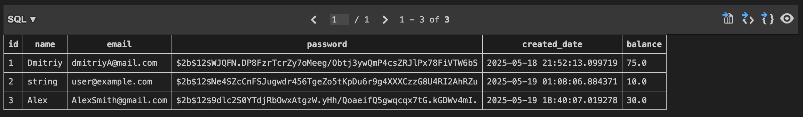
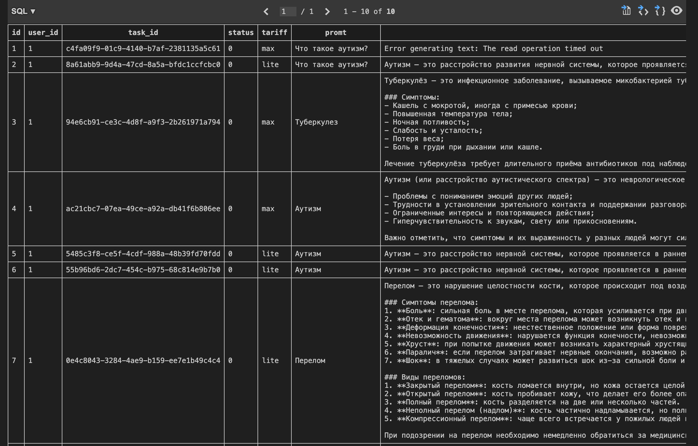
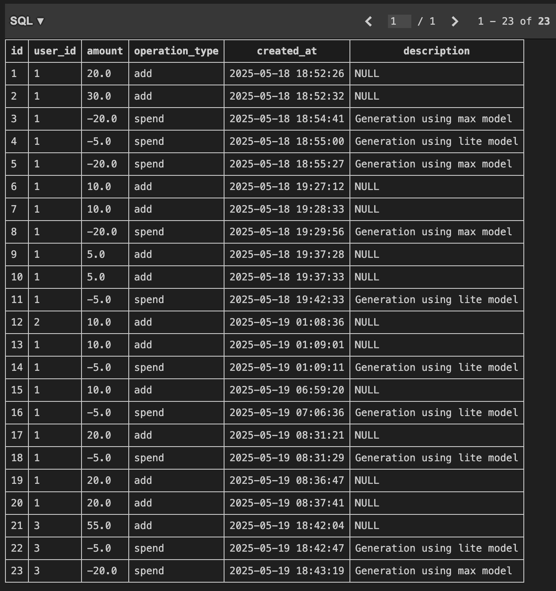

# 🪶 Проект "МедИИ"

## ℹ️ Информация о проекте

Биллинговый сервис с RAG - системой(пока что просто GigaChat) для генерации нужной медицинской информации. Пользователь может получить сведения о заболеваниях, симптомах, методах лечения и других аспектах здоровья, спросив обо всём, что его беспокоит в специальном чате. В проекте используется микросервисная архитектура.

## 🔑 Ключевые возможности

- Авторизация через JWT-токены 🔒
- Микросервисы для отделения клиентской части от моделей 🛠️
- Интегрированная система мониторинга: Prometheus + Grafana 📊

## 📱 UI

---

## ⚙️ Сервисы

- **backend 🌐**

  - FastAPI-приложение для аутентификации, маршрутизации и управления пользователями
  - Использует Redis в качестве брокера и backend-а для Celery
- **worker 🧠**

  - Получает задачи из Redis (через Celery)
  - Выполняет обработку и генерацию
- **frontend 🖼️**

  - Streamlit-интерфейс
  - Подключается к API по адресу `http://backend:8000`
- **reddis 🧩**

  - Хранилище задач и результатов для Celery
- **prometheus** & **grafana** 📈

  - Сбор и визуализация метрик по работе сервисов

## 🔎 Мониторинг

Метрики мониторинга собираются с помощью Grafana + Prometheus

## 🚀 Запуск сервиса

> 1. `git clone https://github.com/n0tmyself/AITH-ML-project.git`
> 2. `cd AITH-ML-project && docker-compose up --build`
